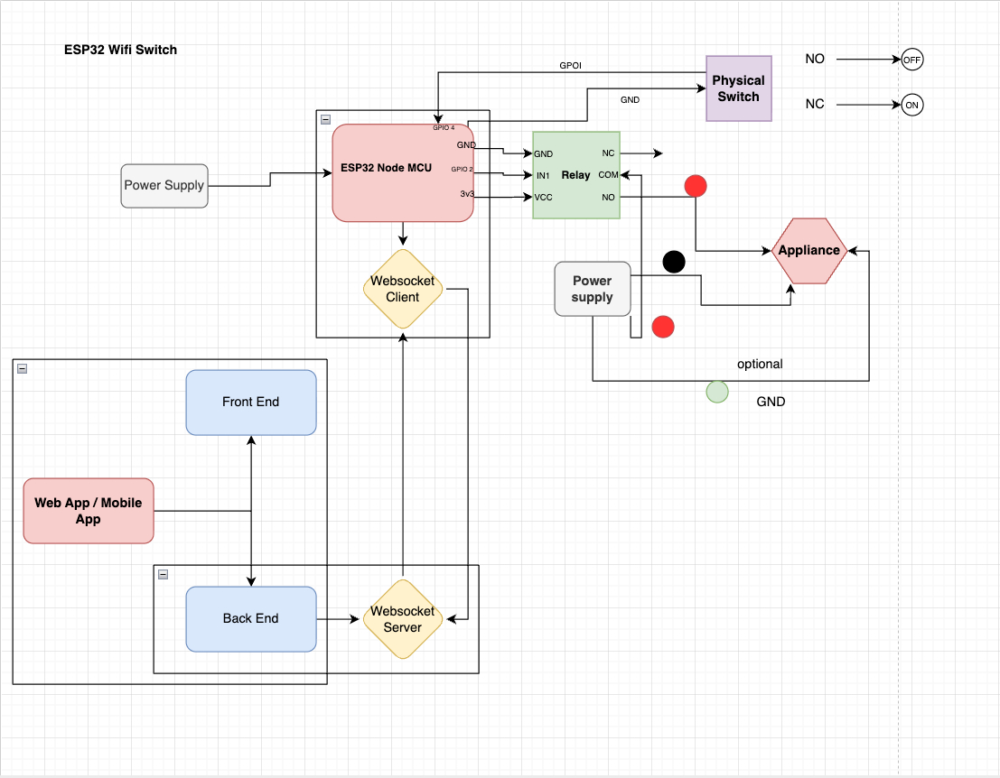

# ESP32 Websockets WiFi Switch

## Overview
You can add this setup behind any Switch Plate/Switchboard in your house/office and you can control all the physical switches through webapp/app etc.
This project implements a WiFi-controlled relay switch using an ESP32 NodeMCU board. The ESP32 connects to a WiFi network and communicates with a WebSocket server over LAN to receive commands and report relay state. The relay state is also controlled by a physical rocker switch with debounce handling. You can also use ESP32-12F

## What It Does
- Connects ESP32 to a predefined WiFi access point.
- Opens a WebSocket client connection to a specified WebSocket server.
- Controls a relay module (active-low) via WebSocket commands or physical rocker switch input.
- Reports relay state changes back over the WebSocket connection.
- Supports simple JSON commands to control pins and relay via the WebSocket client.

## Project Contents
- `src/main.cpp`: Main firmware code for ESP32 handling WiFi, WebSocket client, relay control, and switch input.
- `platformio.ini`: Configuration file for building and uploading firmware via PlatformIO with libraries used.
- `public/ESP32-as-Wifi-Switch_Diagram.drawio`: Architecture and hardware connection diagram for the project.

## Tech Stack
- ESP32 NodeMCU board
- PlatformIO build system and Arduino framework
- Arduino WebSockets library
- ArduinoJson library for JSON parsing
- WebSocket server backend (assumed to be external/not included)

## Setup and Local Development
1. Install [PlatformIO](https://platformio.org) IDE or extension for VSCode.
2. Connect your ESP32 NodeMCU device.
3. Clone this repository.
4. Configure your WiFi credentials and WebSocket server IP/port in `src/main.cpp` file:
    - `WIFI_SSID` and `WIFI_PASSWORD`
    - `WS_HOST` and `WS_PORT`
5. Build and upload the firmware to your ESP32 device using PlatformIO.
6. Run compatible WebSocket server on the specified host to interact with the device.
7. Use WebSocket clients to send relay commands or toggle the physical switch to control the relay.

## Hardware Wiring
- Relay connected at GPIO 23 (active low logic).
- Rocker switch connected to GPIO 18 with internal pull-up resistor.

**Here is the diagram**

  

## Notes
- Relay state is synchronized with WebSocket clients.
- Debounce implemented for physical switch.
- Firmware sends acknowledgements, handles error commands, and maintains WebSocket connection with automatic reconnect.

## Further development
Make it available over the internet.
Add auto timer functions, which will let user to assign the timer to turn On or Off automatically.
Work on stability and size of the relay switch.
Connect it through different sensers.

## License
This project is licensed under the ISC License.

---

Feel free to customize this README further as per your specific firmware or additional features.